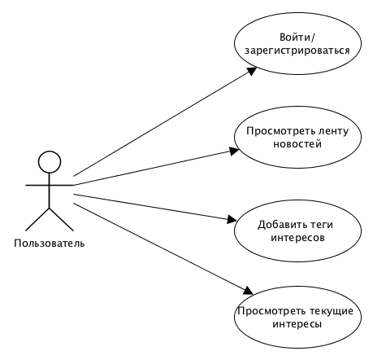
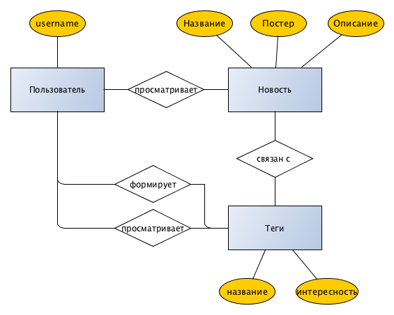

## Название проекта 
SmartFeed
## Предметная область
В повседневной жизни мы зачастую получаем огромное количество информации от различного рода источников. Сортировать весь этот поток порой либо лень, либо же попросту нет времени. Хотелось бы чтобы новости подстраивались под предпочтения, причём чем разнообразнее, тем лучше.
## Основные цели
* Формирование ленты новостей в соответствии с предпочтениями пользователя после того, как он ввёдет интересующие ключевые слова
* Лента новостей гибкая и изменяется в зависимости от предпочтений пользователя
* Возможность просмотра пользовательских интересов
## Use-case диаграмма

## ER-диаграмма 

## Прототип

## Технические решения
Backend:
* Postgresql
* Python + Django

Frontend: 
* Vue.js

Репозиторий:
* Gitlab

Багтрекер:
* Jira/Gitlab Issues

Ревью кода:
* Upsource/Gitlab

CI:
* Jenkins/Gitlab CI
